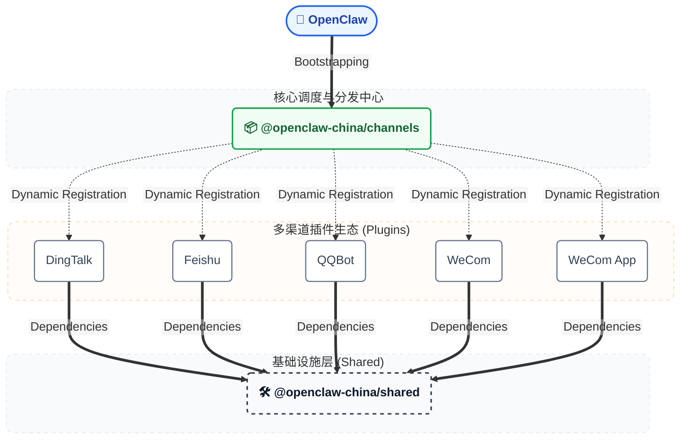

# 🦞 OpenClaw China — China IM Channels

<p align="center">
  <strong>面向中国 IM 平台的 OpenClaw 扩展插件集合</strong>
</p>
<p align="center">
  <a href="#快速开始">快速开始</a> •
  <a href="#总体架构">总体架构</a> •
  <a href="#功能支持">功能支持</a> •
  <a href="#更新日志">更新日志</a> •
  <a href="#演示">演示</a> •
  <a href="#-支持我们">💗 支持我们</a> •
  <a href="#加入交流群"><strong>加入交流群</strong></a>
</p>
<p align="center">
  <strong>⭐ 如果这个项目对你有帮助，请给我们一个Star！⭐</strong><br>
  <em>您的支持是我们持续改进的动力</em>
</p>

<p align="center">
  <strong>🤖 推荐：<a href="https://github.com/BytePioneer-AI/clawmate">ClawMate</a></strong> — 为 OpenClaw 添加有温度的角色伴侣
</p>

<table align="center">
  <thead>
    <tr>
      <th>平台</th>
      <th>状态</th>
      <th>配置复杂度</th>
      <th>配置指南</th>
    </tr>
  </thead>
  <tbody>
    <tr>
      <td>钉钉</td>
      <td align="center">✅ 可用</td>
      <td align="center">简单</td>
      <td><a href="doc/guides/dingtalk/configuration.md">钉钉企业注册指南</a></td>
    </tr>
       <tr>
      <td>QQ 机器人</td>
      <td align="center">✅ 可用</td>
      <td align="center">简单</td>
      <td><a href="doc/guides/qqbot/configuration.md">QQ 渠道配置指南</a></td>
    </tr>
     <tr>
      <td>企业微信（智能机器人）</td>
      <td align="center">✅ 可用</td>
      <td align="center">简单</td>
      <td><a href="doc/guides/wecom/configuration.md">企业微信智能机器人配置指南</a></td>
    </tr>
    <tr>
      <td>企业微信（自建应用-可接入微信）</td>
      <td align="center">✅ 可用</td>
      <td align="center">中等</td>
      <td><a href="doc/guides/wecom-app/configuration.md">企业微信自建应用配置指南</a></td>
    </tr>
    <tr>
      <td>飞书（停止维护）</td>
      <td align="center">✅ 可用</td>
      <td align="center">中等</td>
      <td>-</td>
    </tr>


  </tbody>
</table>

## 功能支持

更多功能在努力开发中~

- **【全网首发】钉钉、QQ、企微支持文件接受和发送**
- **【全网首发】钉钉、QQ、飞书支持定时任务；企微智能机器人长连接支持受限主动发送**

| 功能 | 钉钉 | 飞书 | QQ | 企业微信<br />智能机器人<br />长连接（无需公网IP） | 企业微信自建应用<br />（可接入普通微信） |
|------|:----:|:----:|:--:|:------------------:|:----------------:|
| 文本消息 | ✅ | ✅ | ✅ | ✅ | ✅ |
| Markdown | ✅ | ✅ | ✅ | ✅ | ✅ |
| 流式响应 | ✅ | - | ❌ | ✅ | ❌ |
| 图片/文件 | ✅  | ✅<br />（仅发送） | ✅<br />（出站：私聊任意类型， 群聊仅图片） | ✅（出站文件受限） | ✅<br />（出站任意类型；入站允许图片、音视频、定位、语音） |
| 语音消息 | ✅ | - | ✅ | ✅ | ✅ |
| 私聊 | ✅ | ✅ | ✅ | ✅ | ✅ |
| 群聊 | ✅ | ✅ | ✅ | ✅ | ❌ |
| 多账户 | ✅ | -  | ✅ | ✅ | ✅ |
| 主动发送消息<br />（定时任务） | ✅ | ✅ | ✅ | ✅ | ✅（文本、图片、Markdown） |
| 连接方式 | Stream | WebSocket | - | WebSocket 长连接 | HTTPS 回调 |
| Access Token 缓存 | - | - | - | - | ✅（2 小时有效期） |

## 更新日志

<details>
<summary><strong>点击展开更新日志</strong></summary>


### 2026-03-10
- 修复 `wecom-app` 在开启 `/verbose on` 后将工具日志合并到单条消息、并在任务结束后才一次性发送的问题；现在会按 chunk 逐段主动发送，提升长任务场景下的实时反馈。
- 补充 `wecom-app` 配置文档中的 `/verbose on` 验证步骤、常见问题排查与能力说明，便于升级后快速自检。

### 2026-03-09
- `qqbot` 新增标准 onboarding 适配器，支持在渠道配置流程中直接完成凭证接入与禁用。
- `qqbot` 新增已知目标注册表与主动发送 helper，支持复用现有文本/媒体出站链路做单目标主动发送。

### 2026-03-08
- 主要：** `wecom` 智能机器人新增长连接 `ws` 模式 **，无需 IP 即可配置，并且体验更佳。【全网首发！企微官方3月8日支持长连接模式，本项目当天即支持】
- 主要：** `dingtalk` 新增多账号支持 **，完善默认账号解析、账号配置管理、监控与出站逻辑，并补充多账号测试与配置文档。
- Merge PR #131：修复入站媒体归档在跨分区移动时的 EXDEV 失败问题，避免归档后路径失效，提升共享媒体链路与 `wecom-app` 的稳定性。
- `qqbot` 增强回复可靠性与入站媒体处理，完善回复、发送与客户端链路，并补强相关测试覆盖。
- 修复 `wecom` 多账号多 Agent 场景下入站路由未透传 `accountId` 的问题，避免 `bindings.match.accountId` 失效后消息错误落到默认 Agent。

### 2026-03-07

- Merge PR #127：进一步修复心跳 ACK 上报逻辑，避免通道在无用户消息期间被错误判定为失活。
- `qqbot` 新增长任务通知能力，支持配置延迟时间，提升长耗时任务场景下的交互反馈。
- `qqbot` 支持文件上传与文件名参数，并优化媒体发送链路，补强相关测试覆盖。
- `dingtalk` 新增长任务通知，并将非 AI 回复切换为直接分发，减少回复链路复杂度。
- 文档补充腾讯云 ASR 仅支持国内网络环境的使用提示。

### 2026-03-05

- `qqbot` 在 `msg_id` 失效场景下回退使用 `event_id`，提升定时与异步回发稳定性。
- 优化定时任务稳定性：提醒类任务统一采用 sessionTarget="isolated" + 固定 delivery.channel/to/accountId，避免投递串会话。
- 强化 Cron 创建提示词：明确要求将执行期约束写入 payload.message（仅纯文本、禁止调用工具、禁止手动发送）。

### 2026-03-03

- Merge PR #101：`qqbot` 新增多账户能力，覆盖配置、连接管理与令牌缓存。
- Merge PR #89：修复 `replyFinalOnly=true` 场景下 QQ 工具媒体投递，并支持语音转换。
- Merge 分支 `pr-105`：修复 WeCom / WeCom App webhook 路由注册，并支持多个 webhook 路径。
- 发布脚本新增固定版本控制选项，并同步 README 中 WeCom 问题说明。

### 2026-03-02

- Merge PR #96：修复发送文本消息时的账号检查逻辑。
- Merge PR #95：修复 `wecom-app` 在多账户配置下的消息路由错误。
- `wecom` 渠道增强 XML 解析能力，支持更多消息类型与 CDATA 处理。
- 优化 `wecom-app` 消息发送逻辑，提升发送稳定性。

### 2026-02-28

- 修复企业微信插件异常重启循环问题，提升整体运行稳定性。

### 2026-02-26

- 新增安装提示能力，降低首次安装和排障成本。
- `openclaw china setup` 新增交互式配置向导，减少手动配置步骤。

### 2026-02-25

- Merge PR #73：`wecom-app` 支持以视频播放器形式发送 MP4 视频（`3c32173`）。
- Merge PR #65：钉钉日志补充 `userId/groupId`，便于定向投递排障（`a293250`）。

### 2026-02-15

- 优化企业微信智能机器人的文件发送能力，支持发送多种文件类型。

### 2026-02-14

1. 企业微信支持接入腾讯云 ASR 服务，实现语音转文本。
2. 企业微信自建应用支持在微信侧发送定位，OpenClaw 可读取定位对应的具体位置。
3. 修复企业微信插件无法执行特殊命令的问题（如 `/new`）。
4. 新增企业微信插件定时任务能力。

</details>

## 快速开始

### 1) 安装


#### 方式一：从 npm 安装

**安装统一包（包含所有渠道）**

```bash
openclaw plugins install @openclaw-china/channels
openclaw china setup
```

**或者：安装单个渠道（不要和统一包同时安装）**

```bash
openclaw plugins install @openclaw-china/dingtalk
openclaw china setup
```

```bash
openclaw plugins install @openclaw-china/feishu-china
openclaw china setup
```

```bash
openclaw plugins install @openclaw-china/qqbot
openclaw china setup
```

```bash
openclaw plugins install @openclaw-china/wecom-app
openclaw china setup
```

```bash
openclaw plugins install @openclaw-china/wecom
openclaw china setup
```

#### 更新插件

```bash
openclaw plugins update channels
```


#### 方式二：从源码安装（全平台通用）

> ⚠️ **Windows 用户注意**：由于 OpenClaw 存在 Windows 兼容性问题（`spawn npm ENOENT`），npm 安装方式暂不可用，请使用方式二。

```bash
git clone https://github.com/BytePioneer-AI/openclaw-china.git
cd openclaw-china
pnpm install
pnpm build
openclaw plugins install -l ./packages/channels
openclaw china setup
```

#### 更新源码

```bash
git pull origin main
pnpm install
pnpm build
```

> 链接模式下构建后即生效，重启 Gateway 即可。

> ℹ️ 如果你使用的是旧名称 **clawbot**，请使用 `@openclaw-china/channels@0.1.12`。

### 2) 配置渠道

> 推荐：优先使用「配置向导」`openclaw china setup` 完成配置。下面的 `openclaw config set ...` 为手动配置示例。

<details>
<summary><strong>钉钉</strong></summary>

> 📖 **[钉钉企业注册指南](doc/guides/dingtalk/configuration.md)** — 无需材料，5 分钟内完成配置

```bash
openclaw config set channels.dingtalk.enabled true
openclaw config set channels.dingtalk.clientId dingxxxxxx
openclaw config set channels.dingtalk.clientSecret your-app-secret
openclaw config set channels.dingtalk.enableAICard false
openclaw config set gateway.http.endpoints.chatCompletions.enabled true
```

**可选高级配置**

如果你需要更细粒度控制（例如私聊策略或白名单），可以在 `~/.openclaw/openclaw.json` 中按需添加：

```json5
{
  "channels": {
    "dingtalk": {
      "dmPolicy": "open",          // open | pairing | allowlist
      "groupPolicy": "open",       // open | allowlist | disabled
      "allowFrom": [],
      "groupAllowFrom": []
    },
    "wecom-app": {
      "dmPolicy": "open",          // open | pairing | allowlist | disabled
      "allowFrom": []
    }
  }
}
```

</details>

<details>
<summary><strong>企业微信（自建应用-可接入微信）</strong></summary>

由[@RainbowRain9 Cai Hongyu](https://github.com/RainbowRain9)提供

> 📖 **[企业微信自建应用配置指南](doc/guides/wecom-app/configuration.md)** — 支持主动发送消息

企业微信自建应用支持主动发送消息，需要额外配置 `corpId`、`corpSecret`、`agentId`：

```bash
openclaw config set channels.wecom-app.enabled true
openclaw config set channels.wecom-app.webhookPath /wecom-app
openclaw config set channels.wecom-app.token your-token
openclaw config set channels.wecom-app.encodingAESKey your-43-char-encoding-aes-key
openclaw config set channels.wecom-app.corpId your-corp-id
openclaw config set channels.wecom-app.corpSecret your-app-secret
openclaw config set channels.wecom-app.agentId 1000002
```

（可选）开启语音转文本（腾讯云 Flash ASR）：

```bash
openclaw config set channels.wecom-app.asr.enabled true
openclaw config set channels.wecom-app.asr.appId your-tencent-app-id
openclaw config set channels.wecom-app.asr.secretId your-tencent-secret-id
openclaw config set channels.wecom-app.asr.secretKey your-tencent-secret-key
```

**与智能机器人的区别**

| 功能 | 智能机器人 (wecom) | 自建应用 (wecom-app) |
|------|:------------------:|:--------------------:|
| 被动回复 | ✅ | ✅ |
| 主动发送消息 | ❌ | ✅ |
| 支持群聊 | ✅ | ❌（专注于私聊） |
| 需要 corpSecret | ❌ | ✅ |
| 需要 IP 白名单 | ❌ | ✅ |
| 配置复杂度 | 简单 | 中等 |

**wecom-app 已实现功能清单（摘要）**

- 入站：支持 JSON/XML 回调、验签与解密、长文本分片（2048 bytes）、stream 占位/刷新（5s 规则下缓冲）。
- 入站媒体：image/voice/file/mixed 自动落盘，消息体写入 `saved:` 稳定路径；按 `keepDays` 延迟清理。
  - 设计动机：避免使用 `/tmp` 造成"收到后很快被清理"，确保 OCR/MCP/回发等二次处理有稳定路径可依赖。
- 语音识别：支持接入腾讯云 Flash ASR（录音文件识别极速版）将语音转写为文本。
- 出站：支持主动发送文本与媒体；支持 markdown→纯文本降级（stripMarkdown）。
- 路由与目标：支持多种 target 解析（`wecom-app:user:..` / `user:..` / 裸 id / `@accountId`），减少 Unknown target。
- 策略与多账号：支持 defaultAccount/accounts；dmPolicy/allowlist；inboundMedia(开关/dir/maxBytes/keepDays)。

> 更完整说明见：`doc/guides/wecom-app/configuration.md`

**（可选）安装 wecom-app 专用 Skill**

企业微信自建应用可配套使用 `wecom-app-ops`（target/replyTo/回发图片/录音/文件、OCR/MCP、排障、媒体保留策略）。

安装方式（推荐：Workspace 级）：

```bash
# 在你的项目目录（workspace）下
mkdir -p ./skills
cp -a ~/.openclaw/extensions/openclaw-china/extensions/wecom-app/skills/wecom-app-ops ./skills/
```

或安装方式（全局）：

```bash
mkdir -p ~/.openclaw/skills
cp -a ~/.openclaw/extensions/openclaw-china/extensions/wecom-app/skills/wecom-app-ops ~/.openclaw/skills/
```

> 说明：Workspace > 全局（`~/.openclaw/skills`）> 内置 skills。复制后无需重启网关。

</details>

<details>
<summary><strong>QQ</strong></summary>

> 📖 **[QQ 渠道配置指南](https://github.com/BytePioneer-AI/openclaw-china/blob/main/doc/guides/qqbot/configuration.md)**

```bash
openclaw config set channels.qqbot.enabled true
openclaw config set channels.qqbot.appId your-app-id
openclaw config set channels.qqbot.clientSecret your-app-secret
openclaw config set channels.qqbot.autoSendLocalPathMedia false
```

也可以直接使用一条命令完成接入：

```bash
openclaw channels add --channel qqbot --token "AppID:ClientSecret"
```

（可选）开启语音转文本（腾讯云 Flash ASR）：

```bash
openclaw config set channels.qqbot.asr.enabled true
openclaw config set channels.qqbot.asr.appId your-tencent-app-id
openclaw config set channels.qqbot.asr.secretId your-tencent-secret-id
openclaw config set channels.qqbot.asr.secretKey your-tencent-secret-key
```

如果你希望回复里保留本地证据路径文本，而不是把 `/root/.openclaw/media/qqbot/inbound/...jpeg` 自动再次作为图片发送，可设置：

```bash
openclaw config set channels.qqbot.autoSendLocalPathMedia false
```

主动发送与已知目标：

- 已知目标默认保存到 `~/.openclaw/data/qqbot/known-targets.json`
- 注册表会记录通过策略校验的 `user:` / `group:` / `channel:` 目标
- 推荐主动发送时使用 `user:` 与 `group:` 目标

```ts
import {
  listKnownQQBotTargets,
  sendProactiveQQBotMessage,
} from "@openclaw-china/qqbot";

const targets = listKnownQQBotTargets({ accountId: "default" });

await sendProactiveQQBotMessage({
  cfg: {
    channels: {
      qqbot: {
        appId: "your-app-id",
        clientSecret: "your-app-secret",
      },
    },
  },
  to: targets[0]?.target ?? "user:your-openid",
  text: "这是一条主动发送的 QQ 消息",
});
```

</details>

<details>
<summary><strong>企业微信（智能机器人）</strong></summary>

> 📖 **[企业微信智能机器人配置指南](doc/guides/wecom/configuration.md)**

> 企业微信智能机器人推荐使用长连接 `ws` 模式，无需公网 IP

```bash
openclaw config set channels.wecom.enabled true
openclaw config set channels.wecom.mode ws
openclaw config set channels.wecom.botId your-bot-id
openclaw config set channels.wecom.secret your-bot-secret
```

**注意事项**

- 未填写 `mode` 时，默认也是 `ws`
- `botId` 和 `secret` 需要从企业微信智能机器人后台获取
- 如需旧版公网回调方式，请改用完整配置指南中的 `webhook` 模式说明

</details>

<details>
<summary><strong>飞书</strong></summary>

> 飞书应用需开启机器人能力，并使用「长连接接收消息」模式

openclaw:

```bash
openclaw config set channels.feishu-china.enabled true
openclaw config set channels.feishu-china.appId cli_xxxxxx
openclaw config set channels.feishu-china.appSecret your-app-secret
openclaw config set channels.feishu-china.sendMarkdownAsCard true
```

</details>

### 3) 调试模式启动

```bash
openclaw gateway --port 18789 --verbose
```

## 演示

以下为钉钉渠道效果示例：
> ps: 此为最初版本的演示效果，当前已完美支持Markdown格式。


## 推荐项目

<details>
<summary><strong>点击展开推荐项目</strong></summary>

### 🤖 ClawMate - OpenClaw 角色伴侣插件

> 为 OpenClaw 添加一个有温度的角色伴侣

[ClawMate](https://github.com/BytePioneer-AI/clawmate) 是一个为 OpenClaw 设计的角色伴侣插件，让你的 AI 助手拥有视觉形象和情感温度。

**核心功能**
- ⏰ **时间感知** — 场景和穿搭随时间自动切换（早晨、上课、午休、傍晚、深夜）
- 📸 **情境生图** — 根据对话内容和当前状态生成写实自拍
- 💬 **主动发图** — 日常聊天中随机发自拍表示关心
- 👥 **多角色** — 内置角色 + 对话创建自定义角色
- 🎨 **多图像服务** — 支持阿里云百炼、火山引擎 ARK、fal.ai、OpenAI 兼容接口

**快速安装**
```bash
npx github:BytePioneer-AI/clawmate
```

**应用场景**：个人伴侣、虚拟导师、智能客服、专业顾问

了解更多：[https://github.com/BytePioneer-AI/clawmate](https://github.com/BytePioneer-AI/clawmate)

</details>


## 开发

<details>
<summary><strong>点击展开开发指南</strong></summary>

适合需要二次开发或调试的场景：

```bash
# 克隆仓库
git clone https://github.com/BytePioneer-AI/openclaw-china.git
cd openclaw-china

# 安装依赖并构建
pnpm install
pnpm build

# 以链接模式安装（修改代码后实时生效）
openclaw plugins install -l ./packages/channels
openclaw china setup
```

**示例配置（开发环境）**

```json
{
  "plugins": {
    "load": {
      "paths": ["/path/to/OpenClaw-china/packages/channels"]
    },
    "entries": {
      "channels": { "enabled": true }
    }
  },
  "channels": {
    "dingtalk": {
      "enabled": true,
      "clientId": "dingxxxxxx",
      "clientSecret": "your-app-secret"
    },
    "qqbot": {
      "enabled": true,
      "appId": "your-app-id",
      "clientSecret": "your-app-secret"
    },
    "feishu-china": {
      "enabled": true,
      "appId": "cli_xxxxxx",
      "appSecret": "your-app-secret"
    },
    "wecom": {
      "enabled": true,
      "botId": "your-bot-id",
      "secret": "your-bot-secret"
    },
    "wecom-app": {
      "enabled": true,
      "webhookPath": "/wecom-app",
      "token": "your-token",
      "encodingAESKey": "your-43-char-encoding-aes-key",
      "corpId": "your-corp-id",
      "corpSecret": "your-app-secret",
      "agentId": 1000002
    }
  }
}
```

</details>

<details>
<summary><strong>点击展开总体架构</strong></summary>


### 总体架构

> 当前架构分为宿主、统一通道聚合、各渠道插件和 shared 基础能力层。



</details>

## 💗 支持我们

这是一个公益项目，感谢支持。项目由我们利用业余时间持续开发和维护，后续也会继续更新迭代并提供支持。

如果你愿意支持这个项目，**欢迎帮忙宣传**，并点亮项目**右上角的 Star**。


## 加入交流群

对 OpenClaw 用法、插件感兴趣的可以扫码加入微信群交流。

- 安装问题可以加群询问
- 提PR时遇到开发问题加群询问
- 项目架构细节加群询问
- 插件**BUG**建议提交**issue**

**欢迎同学们一起开发~**


如果二维码过期，可以加下我微信备注说明来意：a28417416

## Star 趋势

<p align="center">
  <a href="https://www.star-history.com/#BytePioneer-AI/openclaw-china&Date">
    <picture>
      <source
        media="(prefers-color-scheme: dark)"
        srcset="https://api.star-history.com/svg?repos=BytePioneer-AI/openclaw-china&type=Date&theme=dark"
      />
      <source
        media="(prefers-color-scheme: light)"
        srcset="https://api.star-history.com/svg?repos=BytePioneer-AI/openclaw-china&type=Date"
      />
      
    </picture>
  </a>
</p>

## License

MIT
